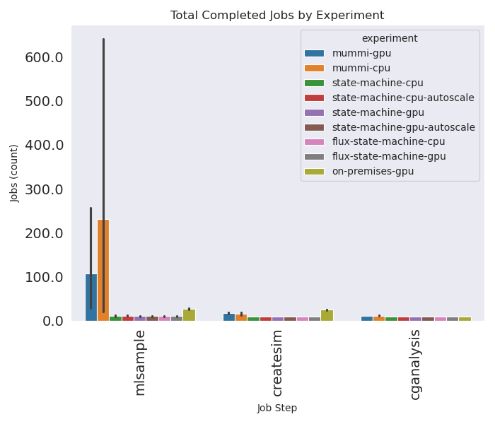
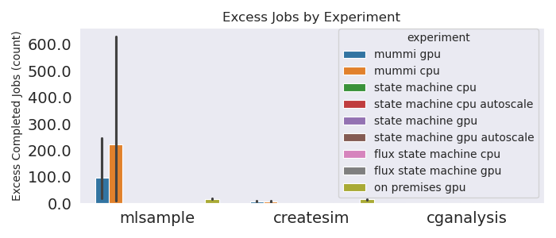
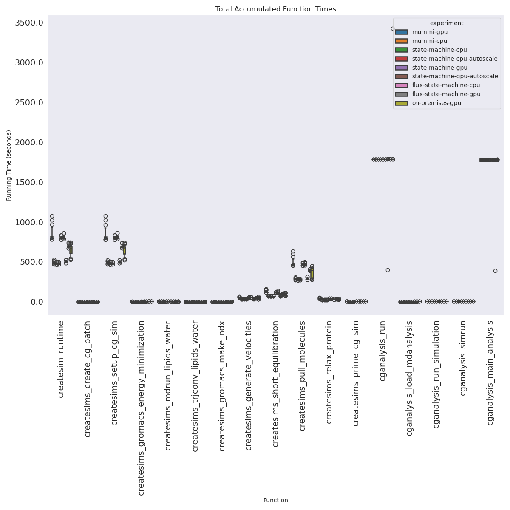
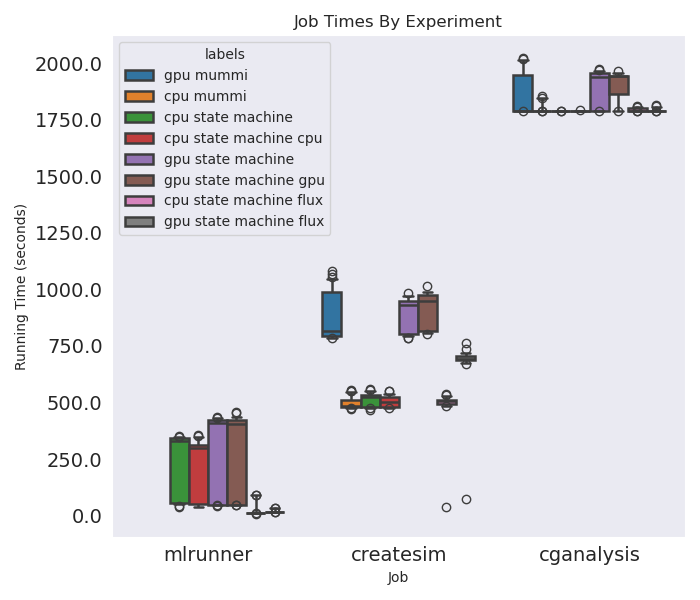
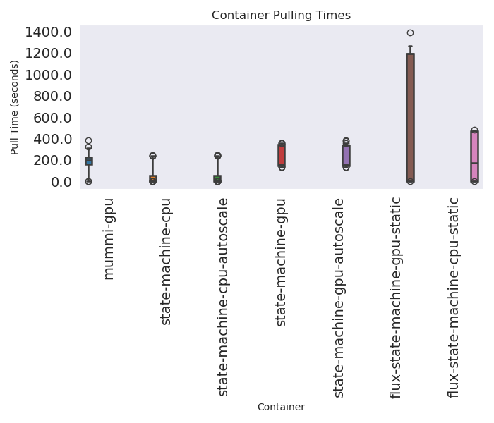
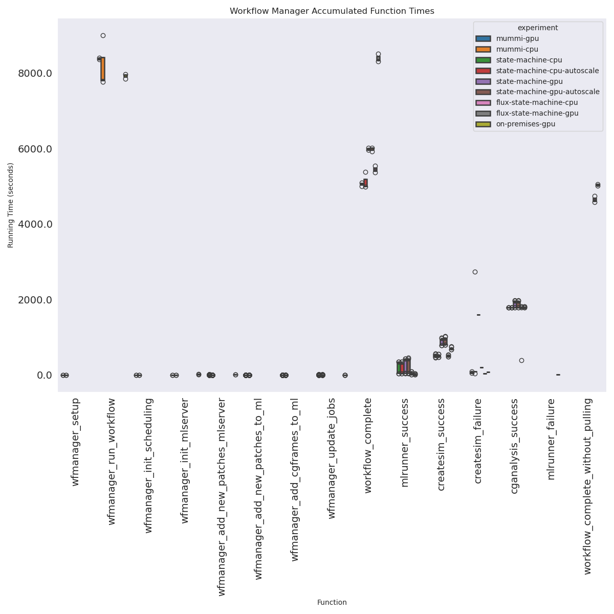
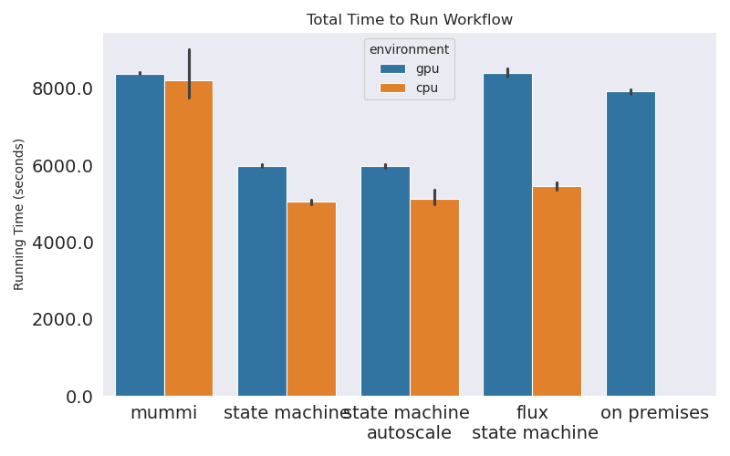
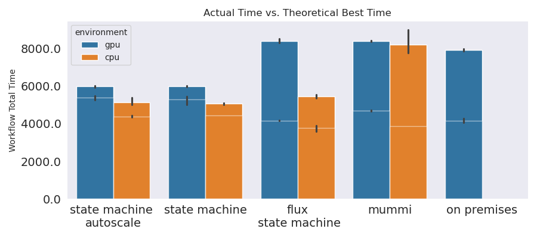
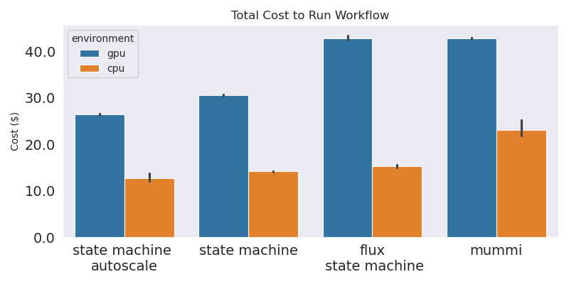

# State Machine Experiment

We are going to test the following setups. We are going to do several experiments, aiming for 3 iterations of each, on a size 6 cluster, 10 completions of cganalysis, which will be either GPU or GPU, and allow autoscaling (removing nodes) or not if applicable. We will always start the cluster and experiments at the largest size, and the autoscaling will mostly be important for removing nodes at the end that are not being used. We will first test createsim to choose the optimal CPU instance type. For GPU we can only choose what is available that we can afford. See [notes.md](notes.md) for early thinking about design.

## Experiments

- [state-machine-operator-autoscaling](state-machine-operator-autoscaling): runs on CPU/GPU with the State Machine Operator, with and without autoscaling.
- [mummi-operator](mummi-operator): runs on CPU/GPU using the MuMMI Operator
- [state-machine-flux](state-machine-flux): runs on CPU/GPU with Virtual Machines using Flux

Note that [state-machine-operator](state-machine-operator) is not used, as it only ran to 6 completions and used an older version of the operator. The static runs for the state machine operator are in the autoscaling directory.

## Analysis

These are early results that summarize across experiments.

### Completed Jobs By Experiment

These plots show that the MuMMI Operator generates far more outputs (completed) than we need.  This doesn't include a handful that were running and not completed when we hit 6 cganalysis samples. None of them have extra cganalysis because we stopped at exactly 6.




### Function Times by Experiment

This shows that the actual running of the steps does not vary based on the orchestrator. I'm not sure how they would (and would be worried if they did).



### Job Times by Experiment

The MLRunner job is unique to the State Machine Operator so it only is there. The jobs are organized based on final status.



```
See workflow running time to get 10 samples
experiment                   global                            
flux-state-machine-cpu       cganalysis_success                    1746.684337
                             createsim_failure                       36.650442
                             createsim_success                      505.366921
                             mlrunner_failure                         7.613389
                             mlrunner_success                        26.574034
                             workflow_complete                     5453.411546
                             workflow_complete_without_pulling     4658.165546
flux-state-machine-gpu       cganalysis_success                    1791.566859
                             createsim_failure                       74.436712
                             createsim_success                      698.774243
                             mlrunner_success                        19.910789
                             workflow_complete                     8396.296784
                             workflow_complete_without_pulling     5040.576451
mummi-cpu                    wfmanager_add_cgframes_to_ml             0.000017
                             wfmanager_add_new_patches_mlserver       1.432169
                             wfmanager_add_new_patches_to_ml          0.000016
                             wfmanager_init_mlserver                  0.019525
                             wfmanager_init_scheduling                0.001005
                             wfmanager_run_workflow                8204.480468
                             wfmanager_setup                          0.039497
                             wfmanager_update_jobs                    3.996264
mummi-gpu                    wfmanager_add_cgframes_to_ml             0.000059
                             wfmanager_add_new_patches_mlserver       0.924778
                             wfmanager_add_new_patches_to_ml          0.000039
                             wfmanager_init_mlserver                  0.019831
                             wfmanager_init_scheduling                0.001808
                             wfmanager_run_workflow                8383.202545
                             wfmanager_setup                          0.049078
                             wfmanager_update_jobs                    3.020139
on-premises-gpu              wfmanager_add_new_patches_mlserver      10.289648
                             wfmanager_init_mlserver                 18.419045
                             wfmanager_run_workflow                7921.181368
                             wfmanager_update_jobs                    1.217027
state-machine-cpu            cganalysis_success                    1788.600051
                             createsim_failure                       64.813726
                             createsim_success                      511.899269
                             mlrunner_success                       210.343512
                             workflow_complete                     5057.044109
state-machine-cpu-autoscale  cganalysis_success                    1788.618145
                             createsim_failure                      614.855364
                             createsim_success                      505.983102
                             mlrunner_success                       189.933387
                             workflow_complete                     5125.136059
state-machine-gpu            cganalysis_success                    1887.482003
                             createsim_failure                     1591.983059
                             createsim_success                      886.281643
                             mlrunner_success                       264.461762
                             workflow_complete                     5985.524573
state-machine-gpu-autoscale  cganalysis_success                    1886.142956
                             createsim_failure                      204.304194
                             createsim_success                      899.218477
                             mlrunner_success                       264.658255
                             workflow_complete                     5985.909382
```

### Pull Times By Experiment

This variation seems large, but it's only a handful of pulls per cluster. I expect this is more of a result of AWS not having a global caching strategy (and generally being less consistent than say, Google Cloud) than anything else. I have lots of pulling data from test runs we could combine here to get a more extensive result.



These are mean times across containers:
```
experiment
mummi-cpu-static                  48.719381
mummi-gpu-static                 181.030326
state-machine-cpu-autoscale       56.327411
state-machine-cpu-static          62.504333
state-machine-flux-cpu-static    217.302556
state-machine-flux-gpu-static    823.852333
state-machine-gpu-autoscale      222.721356
state-machine-gpu-static         216.197821
```

And by container:

```
experiment                     container                                                                                
mummi-cpu-static               633731392008.dkr.ecr.us-east-1.amazonaws.com/mini-mummi:cganalysis-arm                         36.026791
                               633731392008.dkr.ecr.us-east-1.amazonaws.com/mini-mummi:createsims-arm                         54.268591
                               633731392008.dkr.ecr.us-east-1.amazonaws.com/mini-mummi:mlserver-arm                          131.520371
                               633731392008.dkr.ecr.us-east-1.amazonaws.com/mini-mummi:rabbitmq                                3.252676
                               633731392008.dkr.ecr.us-east-1.amazonaws.com/mini-mummi:wfmanager-arm                          96.589913
                               ghcr.io/converged-computing/mummi-operator:test                                                 0.888370
mummi-gpu-static               633731392008.dkr.ecr.us-east-1.amazonaws.com/mini-mummi:cganalysis-gpu                        188.056696
                               633731392008.dkr.ecr.us-east-1.amazonaws.com/mini-mummi:createsims-gpu                        211.954320
                               633731392008.dkr.ecr.us-east-1.amazonaws.com/mini-mummi:mlserver-gpu                          332.784383
                               633731392008.dkr.ecr.us-east-1.amazonaws.com/mini-mummi:rabbitmq                                4.673991
                               633731392008.dkr.ecr.us-east-1.amazonaws.com/mini-mummi:wfmanager                             240.440288
                               ghcr.io/converged-computing/mummi-operator:test                                                 1.447552
state-machine-cpu-autoscale    633731392008.dkr.ecr.us-east-1.amazonaws.com/mini-mummi:cganalysis-arm                          0.838624
                               633731392008.dkr.ecr.us-east-1.amazonaws.com/mini-mummi:createsims-arm                         46.544209
                               633731392008.dkr.ecr.us-east-1.amazonaws.com/mini-mummi:mlrunner-arm                          108.920590
state-machine-cpu-static       633731392008.dkr.ecr.us-east-1.amazonaws.com/mini-mummi:cganalysis-arm                          0.715711
                               633731392008.dkr.ecr.us-east-1.amazonaws.com/mini-mummi:createsims-arm                         48.710707
                               633731392008.dkr.ecr.us-east-1.amazonaws.com/mini-mummi:mlrunner-arm                          126.199604
state-machine-flux-cpu-static  docker://633731392008.dkr.ecr.us-east-1.amazonaws.com/mini-mummi:cganalysis-arm               143.605667
                               docker://633731392008.dkr.ecr.us-east-1.amazonaws.com/mini-mummi:createsims-arm               175.509333
                               docker://633731392008.dkr.ecr.us-east-1.amazonaws.com/mini-mummi:mlrunner-arm-singularity     476.131000
state-machine-flux-gpu-static  docker://633731392008.dkr.ecr.us-east-1.amazonaws.com/mini-mummi:cganalysis-gpu               884.507000
                               docker://633731392008.dkr.ecr.us-east-1.amazonaws.com/mini-mummi:createsims-gpu              1281.552667
                               docker://633731392008.dkr.ecr.us-east-1.amazonaws.com/mini-mummi:mlrunner-gpu                1189.660667
state-machine-gpu-autoscale    633731392008.dkr.ecr.us-east-1.amazonaws.com/mini-mummi:cganalysis-gpu                        160.406983
                               633731392008.dkr.ecr.us-east-1.amazonaws.com/mini-mummi:createsims-gpu                        145.960248
                               633731392008.dkr.ecr.us-east-1.amazonaws.com/mini-mummi:mlrunner-gpu                          348.996667
state-machine-gpu-static       633731392008.dkr.ecr.us-east-1.amazonaws.com/mini-mummi:cganalysis-gpu                        160.938367
                               633731392008.dkr.ecr.us-east-1.amazonaws.com/mini-mummi:createsims-gpu                        138.825408
                               633731392008.dkr.ecr.us-east-1.amazonaws.com/mini-mummi:mlrunner-gpu                          348.829689
```

### Workflow Manager Times

This has events that aren't comparable, except for two (with different names)...



And then we can compare to see the start differences in total workflow running time.



### Actual vs. Theoretical Best Time

This was something I wanted to do (that I think is really interesting). If we add up the actual runtimes for every component plus the container pulling times, we get a theoretical "best" for a particular iteration and setup. In a way, it measures the additional overhead added by the orchestration. Since MuMMI didn't have individual ML runner jobs akin to the others, we use a strategy to sample from the actual runtimes from Flux, which were run on the exact same machines. The reason we see huge overhead (difference in theoretical best and actual time) with MuMMI is because of how it calculates resources. We lose a node to computation due to the workload manager subtracting it, and then further lose a node to the ML server running all the time.




```
Theoretical Best Duration
operator            environment
flux-state-machine  cpu            3772.726359
                    gpu            4164.779461
mummi               cpu            3864.468212
                    gpu            4685.873165
on-premises         gpu            4147.985994
state-machine       cpu            4411.214031
                    gpu            5341.307846

Actual Duration
operator            environment
flux-state-machine  cpu            5453.411546
                    gpu            8396.296784
mummi               cpu            8204.480468
                    gpu            8383.202545
on-premises         gpu            7921.181368
state-machine       cpu            5091.090084
                    gpu            5985.716978
```

### Uptime per node

We can generally see that with autoscaling, 2/6 nodes clean up earlier. This will be reflected in final costs.

```
{
    "state-machine-autoscale-cpu": {
        "1": [
            2856.274454832077,
            4993.940594911575,
            4993.940594911575,
            4993.940594911575,
            4993.940594911575,
            2941.274454832077
        ],
        "2": [
            3242.5922129154205,
            5172.5922129154205,
            5223.5922129154205,
            5374.866969585419,
            5182.5922129154205,
            5207.5922129154205
        ],
        "0": [
            3121.6075434684753,
            2901.6075434684753,
            5006.600611209869,
            5006.600611209869,
            5006.600611209869,
            5006.600611209869
        ]
    },
    "state-machine-autoscale-gpu": {
        "2": [
            6019.346858739853,
            6019.346858739853,
            6019.346858739853,
            3617.9409580230713,
            6019.346858739853,
            3647.9409580230713
        ],
        "0": [
            5926.065628290176,
            5926.065628290176,
            3663.4451377391815,
            5926.065628290176,
            5926.065628290176,
            3528.4451377391815
        ],
        "1": [
            3590.0915966033936,
            6012.31565952301,
            6012.31565952301,
            6012.31565952301,
            3595.0915966033936,
            6012.31565952301
        ]
    },
    "mummi-gpu": {
        "1": [
            8373.977172374725,
            8373.977172374725,
            8373.977172374725,
            8373.977172374725,
            8373.977172374725,
            8373.977172374725
        ],
        "2": [
            8410.330675840378,
            8410.330675840378,
            8410.330675840378,
            8410.330675840378,
            8410.330675840378,
            8410.330675840378
        ],
        "3": [
            8365.29978632927,
            8365.29978632927,
            8365.29978632927,
            8365.29978632927,
            8365.29978632927,
            8365.29978632927
        ]
    },
    "mummi-cpu": {
        "1": [
            7769.607348442078,
            7769.607348442078,
            7769.607348442078,
            7769.607348442078,
            7769.607348442078,
            7769.607348442078
        ],
        "2": [
            9006.884279251099,
            9006.884279251099,
            9006.884279251099,
            9006.884279251099,
            9006.884279251099,
            9006.884279251099
        ],
        "3": [
            7836.949776649475,
            7836.949776649475,
            7836.949776649475,
            7836.949776649475,
            7836.949776649475,
            7836.949776649475
        ]
    },
    "state-machine-cpu": {
        "0": [
            5084.473639726639,
            5084.473639726639,
            5084.473639726639,
            5084.473639726639,
            5084.473639726639,
            5084.473639726639
        ],
        "1": [
            4994.695705413818,
            4994.695705413818,
            4994.695705413818,
            4994.695705413818,
            4994.695705413818,
            4994.695705413818
        ],
        "2": [
            5091.962981462479,
            5091.962981462479,
            5091.962981462479,
            5091.962981462479,
            5091.962981462479,
            5091.962981462479
        ]
    },
    "state-machine-gpu": {
        "0": [
            5980.924844264984,
            5980.924844264984,
            5980.924844264984,
            5980.924844264984,
            5980.924844264984,
            5980.924844264984
        ],
        "1": [
            6016.819443464279,
            6016.819443464279,
            6016.819443464279,
            6016.819443464279,
            6016.819443464279,
            6016.819443464279
        ],
        "2": [
            5958.829431295395,
            5958.829431295395,
            5958.829431295395,
            5958.829431295395,
            5958.829431295395,
            5958.829431295395
        ]
    },
    "flux-state-machine-cpu": {
        "1": [
            5544.855153398514,
            5544.855153398514,
            5544.855153398514,
            5544.855153398514,
            5544.855153398514,
            5544.855153398514
        ],
        "3": [
            5370.4661892204285,
            5370.4661892204285,
            5370.4661892204285,
            5370.4661892204285,
            5370.4661892204285,
            5370.4661892204285
        ],
        "2": [
            5444.913295440674,
            5444.913295440674,
            5444.913295440674,
            5444.913295440674,
            5444.913295440674,
            5444.913295440674
        ]
    },
    "flux-state-machine-gpu": {
        "1": [
            8311.913773790358,
            8311.913773790358,
            8311.913773790358,
            8311.913773790358,
            8311.913773790358,
            8311.913773790358
        ],
        "3": [
            8359.59212933731,
            8359.59212933731,
            8359.59212933731,
            8359.59212933731,
            8359.59212933731,
            8359.59212933731
        ],
        "2": [
            8517.384448869705,
            8517.384448869705,
            8517.384448869705,
            8517.384448869705,
            8517.384448869705,
            8517.384448869705
        ]
    },
    "on-premises-gpu": {
        "0": [
            7966.996721029282,
            7966.996721029282,
            7966.996721029282,
            7966.996721029282,
            7966.996721029282,
            7966.996721029282
        ],
        "1": [
            7951.7755382061,
            7951.7755382061,
            7951.7755382061,
            7951.7755382061,
            7951.7755382061,
            7951.7755382061
        ],
        "2": [
            7844.771843671799,
            7844.771843671799,
            7844.771843671799,
            7844.771843671799,
            7844.771843671799,
            7844.771843671799
        ]
    }
}

```

### Costs

Here are the final costs to get to 10 cganalysis completions. Note that we have to include the container pulls in the final workflow times, since Kubernetes requires it, and so we include Singularity pulls for the flux bare metal.



```
{
    "state-machine-autoscale-cpu": {
        "1": 12.04902302775264,
        "2": 13.746289605970981,
        "0": 12.178196196105482
    },
    "state-machine-autoscale-gpu": {
        "2": 26.641778948354723,
        "0": 26.261729870343206,
        "1": 26.549278956604002
    },
    "mummi-gpu": {
        "1": 42.7072835791111,
        "2": 42.89268644678592,
        "3": 42.66302891027927
    },
    "mummi-cpu": {
        "1": 21.79374861238003,
        "2": 25.264310403299334,
        "3": 21.982644123501778
    },
    "state-machine-cpu": {
        "0": 14.261948559433222,
        "1": 14.01012145368576,
        "2": 14.282956163002252
    },
    "state-machine-gpu": {
        "0": 30.50271670575142,
        "1": 30.685779161667824,
        "2": 30.390030099606516
    },
    "flux-state-machine-cpu": {
        "1": 15.553318705282832,
        "3": 15.064157660763303,
        "2": 15.272981793711091
    },
    "flux-state-machine-gpu": {
        "1": 42.39076024633083,
        "3": 42.633919859620285,
        "2": 43.4386606892355
    },
    "on-premises-gpu": {
        "0": 9.231093534099262,
        "1": 9.2134572569348,
        "2": 9.089475642867725
    }
}
```

And summary of costs:

```
environment  labels                   
cpu          flux\n state machine         15.296819
             mummi                        23.013568
             state machine                14.185009
             state machine \nautoscale    12.657836
gpu          flux\n state machine         42.821114
             mummi                        42.754333
             state machine                30.526175
             state machine \nautoscale    26.371963
```


