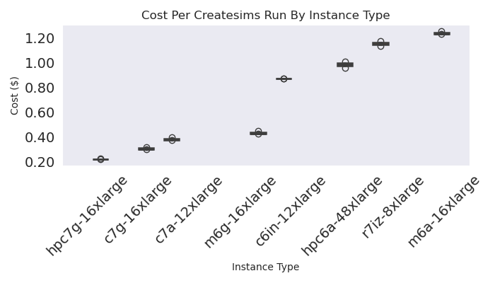

# CPU Node Selector

This portion of the experiment uses the state machine operator to select an ideal node type for the createsims step, and specifically an added feature to allow for [custom properties](https://github.com/converged-computing/state-machine-operator/pull/12). To be consistent in our step, we use the same createsims container that is pre-baked with the analysis and script to process the same gromacs input. We will have the output times for each run, and can choose the instance type based on that. Here are [all the options](https://gist.github.com/vsoch/30803bea5e0bd1b6a0916cef14d54c62) for the cluster autoscaler.

## Docker

In order to make a fair comparison, we need to run the analysis on the same input data. That is done by way of building the container first.

```bash
docker build -t ghcr.io/converged-computing/mummi-experiments:cpu-node-selector .

# And for arm (or better, use the one we already built that is public)
docker buildx build --no-cache --platform linux/arm64 --build-arg tag=createsims-arm --load -t ghcr.io/converged-computing/mummi-experiments:cpu-node-selector-arm -f Dockerfile.arm .
docker push ghcr.io/converged-computing/mummi-experiments:cpu-node-selector-arm

# Run, but be careful if your machine will cough up a fan.
docker run ghcr.io/converged-computing/mummi-experiments:cpu-node-selector

# Or on an arm machine:
docker run -it --entrypoint bash ghcr.io/converged-computing/mummi-experiments:cpu-node-selector-arm /entrypoint.sh
docker push ghcr.io/converged-computing/mummi-experiments:cpu-node-selector
```

## Instance Types

We are going to test CPU, for both ARM and X86. Our one limit is choosing instance types in the same region, which is reasonable (us-east-1) and we will do a one-off run to test hpc6a. See the [configuration YAML files](crd) for the final instances and [notes](notes.md).

## Experiment

Create the cluster. The strategy we use is to have an autoscaling group for each node type we want to test, and then one persistent node where we run services, operators, etc.

```bash
eksctl create cluster --config-file ./crd/eks-config-cpu.yaml
eksctl create cluster --config-file ./crd/eks-config-cpu-spot.yaml
aws eks update-kubeconfig --region us-east-1 --name mini-mummi

# This is for hpc6a (in a different zone)
eksctl create cluster --config-file ./crd/eks-config-hpc6a.yaml
aws eks update-kubeconfig --region us-east-2 --name mini-mummi
```

Install the monitor on the single node that is persistent

```bash
kubectl create namespace monitoring
kubectl apply -f ./event-monitor-cpu
# environ=cpu-autoscale-3
environ=cpu-spot
mkdir -p ./monitor/$environ
kubectl logs -n monitoring $(kubectl get pods -n monitoring -o json | jq -r .items[0].metadata.name) -f |& tee ./monitor/${environ}/events-$(date +%s).json
```

Install the autoscaler, ensure it is running OK, and then install an updated version of the state machine operator.

```bash
kubectl apply -f ./crd/cluster-autoscaler.yaml 
kubectl get pods -n kube-system
# kubectl logs -n kube-system cluster-autoscaler-xxx-xxx
```

Install the state machine operator (commit from March 13, 2025):

```bash
kubectl apply -f crd/state-machine-operator-cpu.yaml 
```

At this point we should have what we need for the experiment. The node test should autoscale the cluster to have one node of each type (so the first pod is pending). Run the experiment!

```bash
# Run separately for each of arm and amd to be conservative
kubectl apply -f crd/cpu-mummi-arm64.yaml
kubectl apply -f crd/cpu-mummi-amd64.yaml
kubectl apply -f crd/cpu-mummi-hpc6a.yaml
```

To save output:
I found the easiest thing to do was expose the headless service, and then oras pull to my local machine.

```bash
# In another terminal
kubectl port-forward registry-0 5000:5000
oras repo ls localhost:5000

mkdir -p ./monitor/$environ/data
cd ./monitor/$environ/data
oras repo ls localhost:5000 > repos.txt
# Download artifacts organized by structure (repo) and step (tag)
registry=localhost:5000
root=$(pwd)
for repo in $(oras repo list --plain-http $registry) 
  do 
    for tag in $(oras repo tags --plain-http $registry/$repo)
      do 
        mkdir -p $root/$repo/$tag
        cd $root/$repo/$tag
        oras pull --plain-http $registry/$repo:$tag
    done
done
cd $root
```

Save cluster autoscaler logs.

```bash
kubectl logs -n kube-system cluster-autoscaler-797bf7c9bc-mtcls > cluster-autoscaler.log
```

And delete.

```bash
eksctl delete cluster --config-file ../crd/eks-config-cpu.yaml
eksctl delete cluster --config-file crd/eks-config-hpc6a.yaml 
```
 
## Analysis

Here we can see that the hpc7g is the greatest bang for the buck, at least for the instances tested here.



```console
instance
c6in-12xlarge     1154.191626
c7a-12xlarge       560.955119
c7g-16xlarge        479.53508
hpc6a-48xlarge    1234.329169
hpc7g-16xlarge     479.034933
m6a-16xlarge      1615.040867
m6g-16xlarge       636.083563
r7iz-8xlarge      1399.340623
```

But does the hpc7g take longer?

```console
c6in-12xlarge     1154.191626
c7a-12xlarge       560.955119
c7g-16xlarge        479.53508
hpc7g-16xlarge     479.034933
m6a-16xlarge      1615.040867
m6g-16xlarge       636.083563
r7iz-8xlarge      1399.340623
```

For runs with only 2 samples, one of the runtimes went over and the job was cancelled. The c7a-12xlarge
I used for testing and saved the extra data. The times are really consistent so it seems OK to include and not throw off the distribution, but if we want, we can randomly select 3 (or choose the last 3).

```console
Name: duration, dtype: object
instance
c6in-12xlarge     0.872697
c7a-12xlarge      0.383787
c7g-16xlarge      0.309034
hpc6a-48xlarge    0.987463
hpc7g-16xlarge    0.223949
m6a-16xlarge      1.240441
m6g-16xlarge      0.435364
r7iz-8xlarge      1.156788
```
```console
                iteration  event  duration  global  hourly_cost  hours  cost
instance                                                                    
c6in-12xlarge           2      2         2       2            2      2     2
c7a-12xlarge           12     12        12      12           12     12    12
c7g-16xlarge            3      3         3       3            3      3     3
hpc6a-48xlarge          3      3         3       3            3      3     3
hpc7g-16xlarge          3      3         3       3            3      3     3
m6a-16xlarge            3      3         3       3            3      3     3
m6g-16xlarge            3      3         3       3            3      3     3
r7iz-8xlarge            2      2         2       2            2      2     2
```
