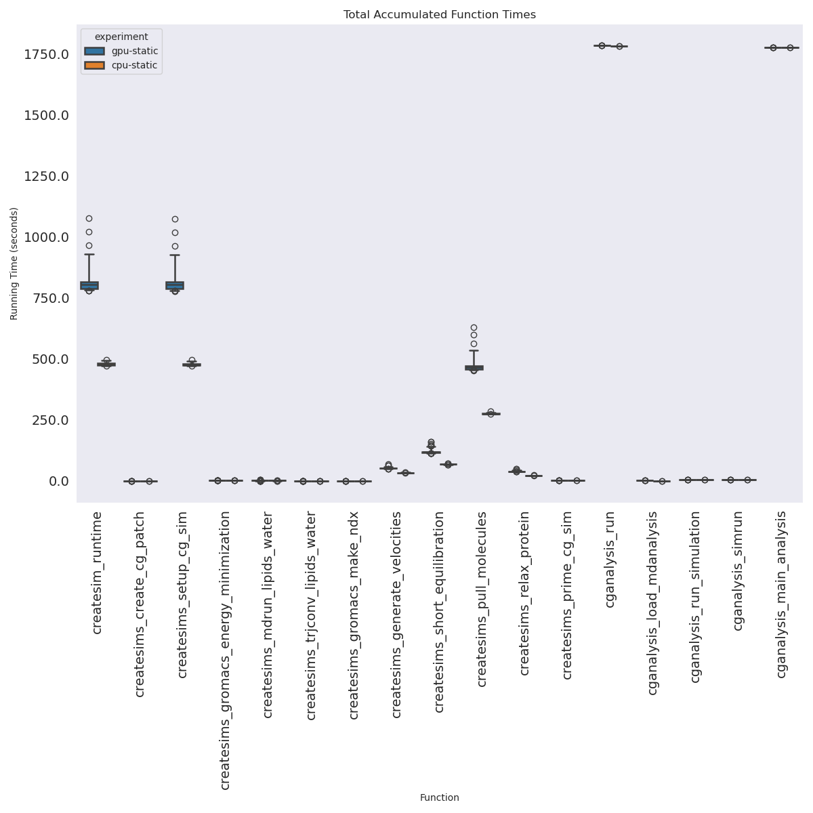
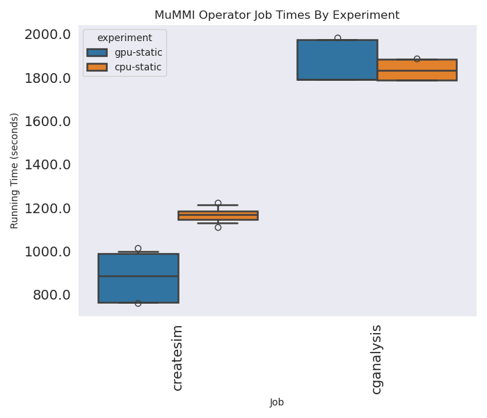
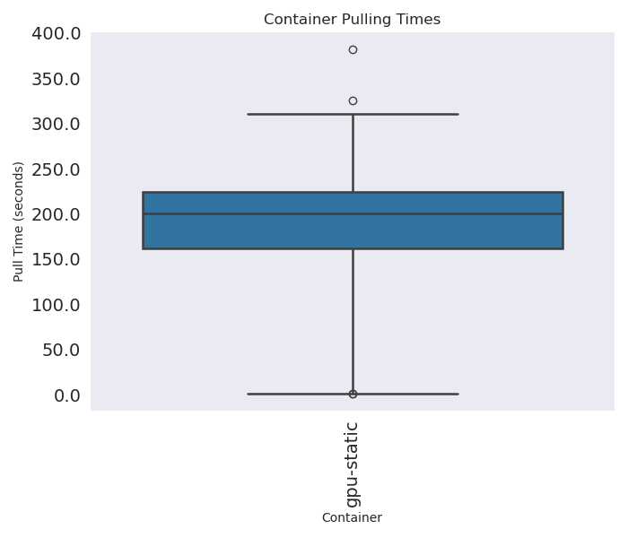

# Mummi Operator Experiment

> This paradigm is part of the Mummi experiments. Here we are testing using the Mummi Operator, which uses the mlserver and rabbitmq for work.

We won't run autoscaling with the Mummi Operator, the reason being that it doesn't make a difference. Traditional mummi has no understanding of when it is done, so jobs continue to be submitted, so autoscaling would not kick in to downscale the cluster. Note that to get the exact digests for containers used, see the final-pods-state.json files in the monitor sub-directories here.

```bash
git clone https://github.com/converged-computing/mummi-experiments
cd ./mummi-experiments/experiments/aws-march-2025/mummi-operator
```
Final results:

 - cpu-static-1 is final for CPU
 - gpu-static-1 is final for GPU

## Experiments

There will be two experiments - one for GPU and one for CPU.

```bash
# GPU
eksctl create cluster --config-file ../eks-config-gpu-static.yaml
aws eks update-kubeconfig --region us-east-1 --name mini-mummi-gpu

# CPU
eksctl create cluster --config-file ../eks-config-cpu-static.yaml 
aws eks update-kubeconfig --region us-east-2 --name mini-mummi
```

```bash
kubectl create namespace monitoring
kubectl apply -f ../../../event-monitor

# In a different terminal, this will save nodes and collect events.
environ=cpu-static-1
region=us-east-2
instance=hpc6a.48xlarge

# environ=gpu-static-1
# region=us-east-1
# instance=p3.2xlarge

mkdir -p ./monitor/${environ}
kubectl get nodes -o json > ./monitor/${environ}/nodes-$(date +%s).json

# Topology API (only for hpc instance types)
# Note that I was running an a la carte gpu instance in this region, needs to be filtered out
aws ec2 describe-instance-topology --region ${region} --filters Name=instance-type,Values=${instance} > ./monitor/${environ}/topology.json
aws ec2 describe-instances --filters "Name=instance-type,Values=${instance}" --region ${region}  > ./monitor/${environ}/instances.json

kubectl logs -n monitoring $(kubectl get pods -n monitoring -o json | jq -r .items[0].metadata.name) -f |& tee ./monitor/${environ}/events-$(date +%s).json
```

#### Mummi Operator

This is private, so we install from a local build.

```bash
# commit used for GPU and CPU final runs: c1c45464eaa360116cb7ab6b1787b46bbcbf2ad7
git clone https://github.com/converged-computing/mummi-operator
cd mummi-operator
make test-deploy-recreate
```

Run the Experiment:

```bash
kubectl apply -f ./crd/gpu-mummi.yaml
kubectl apply -f ./crd/cpu-mummi.yaml
```

Note that the mummi-operator wfmanager is not resilient to starting. If this is the case, you can delete the pod and it will be re-created. 

## Saving data files

When the workflow is complete, we can save the state, etc. First, get output for the different components. For each of the mlserver, rabbitmq, and wfmanager, do:

```bash
# In a different terminal, this will save nodes and collect events.
# environ=gpu-static-1
environ=cpu-static-1

#kubectl logs <container>  > ./monitor/${environ}/<container>.out
kubectl get pods -o wide > ./monitor/${environ}/final-pods-state.txt
kubectl get pods -o json > ./monitor/${environ}/final-pods-state.json
```

I found the easiest thing to do was expose the headless service, and then oras pull to my local machine.

```bash
# In another terminal
kubectl port-forward registry-0 5000:5000
oras repo ls localhost:5000

mkdir -p ./monitor/$environ/data
cd ./monitor/$environ/data
oras repo ls localhost:5000 > repos.txt
# Download artifacts organized by structure (repo) and step (tag)
registry=localhost:5000
root=$(pwd)
for repo in $(oras repo list --plain-http $registry) 
  do 
    for tag in $(oras repo tags --plain-http $registry/$repo)
      do 
        mkdir -p $root/$repo/$tag
        cd $root/$repo/$tag
        oras pull --plain-http $registry/$repo:$tag
    done
done
```

For the workflow manager to get times:

```bash
pixi shell
pixi add htop
# get wfmanager process
htop
kill -s SIGINT <process_id>
kill -s SIGINT 364
```

## Cleanup

```bash
# GPU
kubectl delete -f crd/gpu-mummi.yaml
eksctl delete cluster --config-file ../eks-config-gpu-static.yaml --wait

# CPU
kubectl delete -f crd/cpu-mummi.yaml
eksctl delete cluster --config-file ../eks-config-cpu-static.yaml --wait
```

## Notes

- For the GPU runs, one of the createsims ran the entire duration of the study, meaning there was only one node for createsims. It increased the time by 1.5x likely, and the study (cost) is going to be hugely impacted by it.
- For the CPU runs, where there is an error (and the job is deleted) and a temporary change to the number of createsims job, the condition kicks in to generate more samples, and typically multiple iterations run to generate more samples than are needed. We would want this to happen, but for the sample generation to be more tightly linked with what is needed for createsims. For example, we only needed one sample here, but multiple loops were run to generate about 10 more.

Also see [notes](notes.md) from testing runs.

## Quick Analysis

Notes:

 - There was one createsims job in the GPU run that never completed, so its running time is the full workflow. It's an outlier that is removed from the plot.
 - The workflow and analysis times are filtered to not include anything < 1 second
 
These are just some quick glances at a small amount of data for the runs here. I still need to add the state machine operator runs, do autoscaling runs, add both to these plots, then calculate costs. These are only moderately interesting to suggest that GPU is faster than CPU for this one setup using the MuMMI Operator (and costs TBA). I can guarantee you the state machine operator is much faster to do the same work!



Some quick glances at output - this is hugely incomplete because we aren't comparing to anything interesting, but it's a start to parsing results.

### Job Times

This shows total job times for each job type between environments. The createsim cpu static was hurt because one of the jobs ran for the entire lifecycle of the workflow, occupying an entire node, and never finished. This means we ran with 1 instead of 2 nodes for that entire job family, which I imagine at least 1.5x the time.  These are mean job times:

```console
job         experiment
cganalysis  cpu-static    11011
            gpu-static    12764
createsim   cpu-static    11671
            gpu-static     6999
```


Here are times in a format easier to parse - these are the total summed times across jobs (so much longer than total experiment).

```console
cpu-static  cganalysis_load_mdanalysis              cganalysis        2.848357
            cganalysis_main_analysis                cganalysis    10669.224872
            cganalysis_run                          cganalysis    10702.452909
            cganalysis_run_simulation               cganalysis       30.064158
            cganalysis_simrun                       cganalysis       30.063611
            createsim_runtime                       createsim     11539.840796
            createsims_create_cg_patch              createsim         0.008023
            createsims_generate_velocities          createsim       795.179892
            createsims_gromacs_energy_minimization  createsim         13.77891
            createsims_gromacs_make_ndx             createsim         3.853949
            createsims_mdrun_lipids_water           createsim        62.172606
            createsims_prime_cg_sim                 createsim         9.299346
            createsims_pull_molecules               createsim      6723.913401
            createsims_relax_protein                createsim       524.463825
            createsims_setup_cg_sim                 createsim     11530.384827
            createsims_short_equilibration          createsim      3381.785427
            createsims_trjconv_lipids_water         createsim          3.13095
gpu-static  cganalysis_load_mdanalysis              cganalysis         4.54782
            cganalysis_main_analysis                cganalysis    10669.915184
            cganalysis_run                          cganalysis     10705.02571
            cganalysis_run_simulation               cganalysis        30.06628
            cganalysis_simrun                       cganalysis       30.065417
            createsim_runtime                       createsim      5985.272172
            createsims_create_cg_patch              createsim         0.010622
            createsims_generate_velocities          createsim       375.236755
            createsims_gromacs_energy_minimization  createsim        31.108696
            createsims_gromacs_make_ndx             createsim         4.059878
            createsims_mdrun_lipids_water           createsim        61.680779
            createsims_prime_cg_sim                 createsim        12.679048
            createsims_pull_molecules               createsim      3447.000841
            createsims_relax_protein                createsim       286.955927
            createsims_setup_cg_sim                 createsim      5972.406913
            createsims_short_equilibration          createsim      1727.927006
            createsims_trjconv_lipids_water         createsim         7.306555
Name: duration, dtype: object
```

### Pull Times

These are total summed pulling times, just for containers relevant to mummi (the others are small and trivial anyway). Obviously GPU containers are bigger and take longer.

```console
experiment
cpu-static     864.742588
gpu-static    2028.059534
```



### Job Counts Completed

These are job completions, as assessed by the output that we have. Note that this does not include jobs that were running and didn't complete.

```console
Experiment Job Counts (completed with results)
   experiment         job count
0  cpu-static    mlsample    32
1  cpu-static   createsim    10
2  cpu-static  cganalysis     6
3  gpu-static    mlsample    18
4  gpu-static   createsim     8
5  gpu-static  cganalysis     6
```

Given we needed just 6, here are excess.

```console
Excess Completed
   experiment         job count
0  cpu-static    mlsample    26
1  cpu-static   createsim     4
2  cpu-static  cganalysis     0
3  gpu-static    mlsample    12
4  gpu-static   createsim     2
5  gpu-static  cganalysis     0
```

The mlsample generates quickly enough that we will not have any partial results (generated but not done).

### Partial Job Excess

These are running that started but didn't complete. You can look at the final-pod-state.txt in each output directory to see where this comes from. These are in _addition_ to the excess above in terms of time. We could likely calculate the extra cost of these extra completed runs and incompleted partial runs.

- GPU:
  - createsim: 2 running (107m, 3m35s) - the first here is the job that ran for the entire experiment!
  - cganalysis: 2 running (17m, 3m51s)
- CPU:
  - createsim: 2 running (4m 21s, 69s)
  - cganalysis: 3 running (114s, 14m, 22m)


### Workflow Manager Times

We can look at summed times for the workflow manager, and really there are only a few that add up to anything significant.

```console
experiment  global                            
cpu-static  wfmanager_add_cgframes_to_ml             0.011165
            wfmanager_add_new_patches_mlserver     149.925664
            wfmanager_add_new_patches_to_ml          0.007669
            wfmanager_init_mlserver                  0.019922
            wfmanager_init_scheduling                0.000901
            wfmanager_run_workflow                6347.938754
            wfmanager_setup                          0.029337
            wfmanager_update_jobs                  504.523301
gpu-static  wfmanager_add_cgframes_to_ml             0.016649
            wfmanager_add_new_patches_mlserver     135.387265
            wfmanager_add_new_patches_to_ml          0.012758
            wfmanager_init_mlserver                  0.019885
            wfmanager_init_scheduling                0.001567
            wfmanager_run_workflow                6557.589562
            wfmanager_setup                          0.048264
            wfmanager_update_jobs                  616.059775
Name: duration, dtype: object
```

Here we see the most relevant is the workflow running time to get 6 samples - we will want to compare this across environments.

```console
experiment  global                            
cpu-static  wfmanager_add_new_patches_mlserver       0.353598
            wfmanager_run_workflow                6347.938754
            wfmanager_update_jobs                    1.189913
gpu-static  wfmanager_add_new_patches_mlserver       0.309103
            wfmanager_run_workflow                6557.589562
            wfmanager_update_jobs                    1.406529
Name: duration, dtype: object
```
