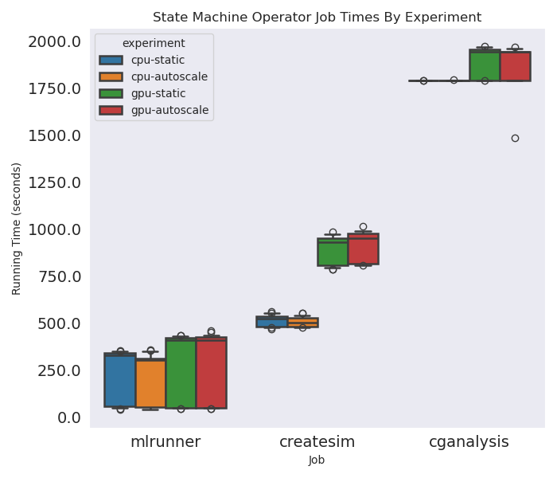
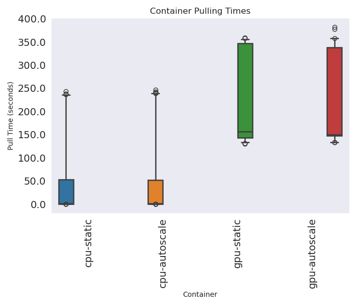
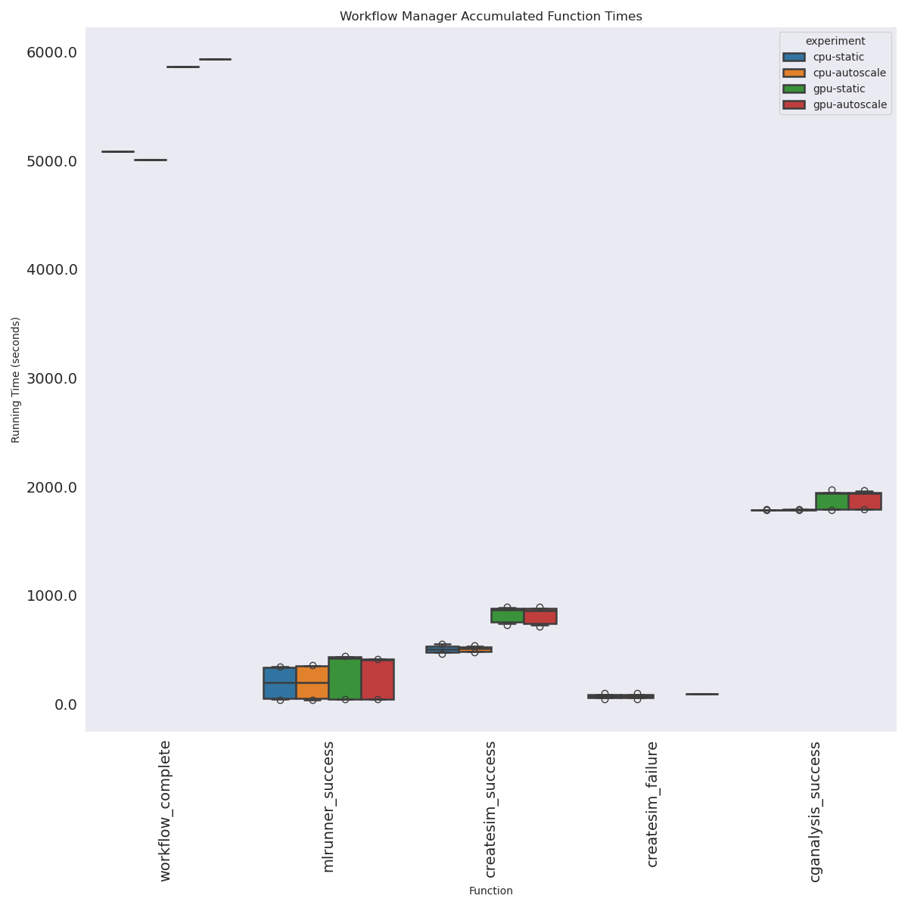
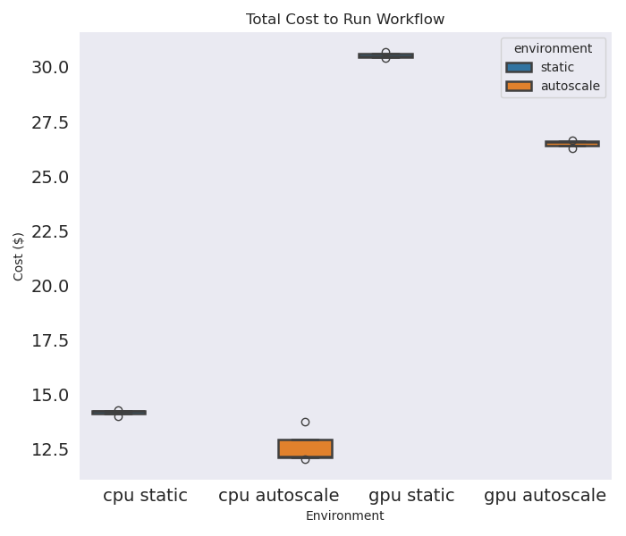
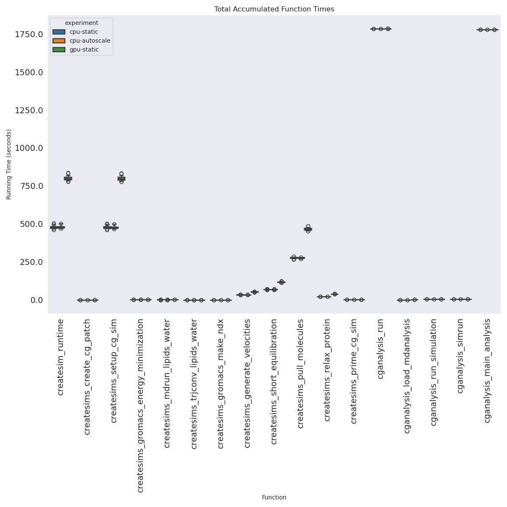

# State Machine Operator Experiment

> This paradigm is part of the Mummi experiments. Here we are testing using the State Machine Operator, which uses a state machine and removes some of the persistent services in favor of Kubernetes events

```bash
git clone https://github.com/converged-computing/mummi-experiments
cd ./mummi-experiments/experiments/aws-march-2025/state-machine-operator
```

Note that feedback files were generated and used, but not added here (there are a lot of files). Note that for cpu-arm-autoscale-1 I lost internet, and that is why there are multiple event files (with redundant data). Since we take uniqueness here it is not an issue.

## Output

### CPU (ARM)

 - cpu-arm-autoscale (March 13, 2025)
 - cpu-arm-autoscale-0 (March 13, 2025)
 - cpu-arm-autoscale-1 (March 15, 2025)
 - cpu-arm-no-autoscaling (March 13, 2025)
 - cpu-arm-no-autoscaling-0 (March 14, 2025)
 - cpu-arm-no-autoscaling-1 (March 14, 2025)

### GPU

 - gpu-autoscale (March 15, 2025)
 - gpu-autoscale-0 (March 15, 2025)
 - gpu-autoscale-1 (March 15, 2025)
 - gpu-no-autoscaling (March 14, 2025) 
 - gpu-no-autoscaling-0 (March 14, 2025) 
 - gpu-no-autoscaling-1 (March 14-15, 2025) 
 
## Experiments

There will be four experiments - one for GPU and one for CPU, and each with and without autoscaling. This means these commands each need to be done twice, and the first time without installing the autoscaler.

```bash
# GPU
eksctl create cluster --config-file ./crd/eks-config-gpu-autoscaling.yaml
aws eks update-kubeconfig --region us-east-1 --name mini-mummi-gpu

# CPU (ARM)
eksctl create cluster --config-file ./crd/eks-config-cpu-arm-autoscaling.yaml
aws eks update-kubeconfig --region us-east-1 --name mini-mummi
```

```bash
# This makes the monitor a sticky node
kubectl create namespace monitoring
kubectl apply -f ./event-monitor-gpu
# kubectl apply -f ./event-monitor-arm

# In a different terminal, this will save nodes and collect events.
# environ=cpu-arm-autoscale-1
# environ=cpu-arm-no-autoscaling-1
# region=us-east-1
# instance=hpc7g.16xlarge

# environ=gpu-no-autoscaling-1
environ=gpu-autoscale-1
region=us-east-1
instance=p3.2xlarge

mkdir -p ./monitor/${environ}
kubectl get nodes -o json > ./monitor/${environ}/nodes-$(date +%s).json

# Topology API (only for hpc instance types)
# aws ec2 describe-instance-topology --region ${region} --filters Name=instance-type,Values=${instance} > ./monitor/${environ}/topology.json
aws ec2 describe-instances --filters "Name=instance-type,Values=${instance}" --region ${region}  > ./monitor/${environ}/instances.json
kubectl logs -n monitoring $(kubectl get pods -n monitoring -o json | jq -r .items[0].metadata.name) -f |& tee ./monitor/${environ}/events-$(date +%s).json
```

#### State Machine Operator

Install the operator. Note this requires pushing to a development registry, and you'd need to customize if you don't have access (you likely won't, but I doubt anyone will try to reproduce this).

```bash
# autoscaling: ad29dab058184607a9a734e43293486d82c4e388 March 13, 2025.
# One cpu run used the previous commit (no recorded_at time, which we don't use)
# These have sticky nodes
kubectl apply -f crd/state-machine-operator-cpu.yaml
kubectl apply -f crd/state-machine-operator-gpu.yaml
```

Run the Experiment. Note that since the resources here are going directly to Kubernetes, we ask for exactly what we want each job to have.

```bash
kubectl apply -f ./crd/cpu-arm-mummi-autoscale.yaml
kubectl apply -f ./crd/gpu-mummi-autoscale.yaml
```

Once the cluster is up, what I did is wait until the first round of work was done, and then installed the autoscaler (this has a node selector for the sticky node). Note you only need to do this for the experiments with autoscaling!

```bash
# For arm or cpu (these have different node selectors)
kubectl apply -f crd/cluster-autoscaler-cpu-arm.yaml
kubectl apply -f crd/cluster-autoscaler-gpu.yaml
```

Note that the registry and manager are annotated with a label to be assigned to the sticky node. They won't be evicted.

## Saving data files

When the workflow is complete, we can save the state, etc. First, get output for the different components. For each of the manager and registry, do:

```bash
# In a different terminal, this will save nodes and collect events.
# environ=cpu-arm-no-autoscaling-1
# environ=cpu-arm-autoscale-1
# environ=gpu-no-autoscaling
environ=gpu-autoscale-1

#kubectl logs <container>  > ./monitor/${environ}/<container>.out
kubectl get pods -o wide > ./monitor/${environ}/final-pods-state.txt
kubectl get pods -o json > ./monitor/${environ}/final-pods-state.json

# Copy times from the manager
kubectl cp mummi-manager-86ddd95986-5gctw:/workflow-times.json workflow-times.json
kubectl cp mummi-manager-55b864fb8f-z4wvl:/cluster-nodes.json ./cluster-nodes.json
kubectl get nodes -o wide > nodes.txt

# Autoscaler logs (if deployed)
kubectl logs -n kube-system cluster-autoscaler > cluster-autoscaler.out
```

I found the easiest thing to do was expose the headless service, and then oras pull to my local machine.

```bash
# In another terminal
kubectl port-forward registry-0 5000:5000
oras repo ls localhost:5000

mkdir -p ./monitor/$environ/data
cd ./monitor/$environ/data
oras repo ls localhost:5000 > repos.txt
# Download artifacts organized by structure (repo) and step (tag)
registry=localhost:5000
root=$(pwd)
for repo in $(oras repo list --plain-http $registry) 
  do 
    for tag in $(oras repo tags --plain-http $registry/$repo)
      do 
        mkdir -p $root/$repo/$tag
        cd $root/$repo/$tag
        oras pull --plain-http $registry/$repo:$tag
    done
done
cd $root
```

## Cleanup

what did the jail officer tell his supervisor about the escaping shape.
he was there N-gone!

```bash
# GPU
kubectl delete -f crd/gpu-mummi-autoscale.yaml
eksctl delete cluster --config-file ./crd/eks-config-gpu-autoscaling.yaml --wait

# CPU
kubectl delete -f crd/cpu-mummi-autoscale.yaml
eksctl delete cluster --config-file ./crd/eks-config-cpu-arm-autoscaling.yaml --wait
```

## Quick Analysis

### Job Times

This shows mean job time for each component and environment environments.  When createsims failed (which it did several times for the cpu runs) it failed quickly. In practice the mlrunner runs in about ~200 seconds and it failed in ~73, so it added a few minutes extra for one node.

```console
experiment     global              iteration
cpu-autoscale  cganalysis_success  0            17887.433075
                                   1            17882.476771
                                   2            17888.634518
               createsim_failure   0              145.010041
                                   1               98.350998
                                   2             2830.915782
               createsim_success   0             5081.137343
                                   1             5102.381859
                                   2             4995.973853
               mlrunner_success    0             2405.186497
                                   1              2073.40269
                                   2             2169.079353
               workflow_complete   0             5006.600611
                                   1             4993.940595
                                   2              5374.86697
cpu-static     cganalysis_success  0            17886.905851
                                   1            17885.591606
                                   2            17885.504066
               createsim_failure   0               147.01553
                                   2               47.425648
               createsim_success   0             5089.432118
                                   1             5120.167689
                                   2             5147.378264
               mlrunner_success    0             2357.309738
                                   1             2293.776509
                                   2             2290.249635
               workflow_complete   0              5084.47364
                                   1             4994.695705
                                   2             5091.962981
gpu-autoscale  cganalysis_success  0            18845.954653
                                   1            18363.762444
                                   2            18826.709348
               createsim_failure   2              204.304194
               createsim_success   0             8907.126935
                                   1             8966.169381
                                   2             8991.261782
               mlrunner_success    0             2673.134994
                                   1              2752.80203
                                   2             2787.571181
               workflow_complete   0             5926.065628
                                   1             5981.895966
                                   2             6019.346859
gpu-static     cganalysis_success  0            18879.713266
                                   1            18909.591505
                                   2            18835.155305
               createsim_failure   0             1591.983059
               createsim_success   0             8755.175833
                                   1             8997.380721
                                   2             8835.892748
               mlrunner_success    0             2724.749233
                                   1             2764.735792
                                   2             2708.829597
               workflow_complete   0             5980.924844
                                   1             6016.819443
                                   2             5958.829431
Name: duration, dtype: object
```

These are total accumulated job times:

```console
job         experiment   
cganalysis  cpu-autoscale    53662
            cpu-static       53660
            gpu-autoscale    30032
            gpu-static       54649
createsim   cpu-autoscale    15179
            cpu-static       15356
            gpu-autoscale    15559
            gpu-static       26590
mlrunner    cpu-autoscale     6655
            cpu-static        6945
            gpu-autoscale     8026
            gpu-static        8198
Name: duration, dtype: object
```

Here are the total samples generated for each. CGanalysis always has 10 because that is the workflow manager's directed final state. We have extra for other components that correspond to the number of createsims failures. 

```console
Experiment Job Counts (completed with results)
       experiment         job count iteration
0      cpu-static    mlsample    12         0
1      cpu-static   createsim    10         0
2      cpu-static  cganalysis    10         0
3      cpu-static    mlsample    10         1
4      cpu-static   createsim    10         1
5      cpu-static  cganalysis    10         1
6      cpu-static    mlsample    11         2
7      cpu-static   createsim    10         2
8      cpu-static  cganalysis    10         2
9   cpu-autoscale    mlsample    12         0
10  cpu-autoscale   createsim    10         0
11  cpu-autoscale  cganalysis    10         0
12  cpu-autoscale    mlsample    11         1
13  cpu-autoscale   createsim    10         1
14  cpu-autoscale  cganalysis    10         1
15  cpu-autoscale    mlsample    12         2
16  cpu-autoscale   createsim    10         2
17  cpu-autoscale  cganalysis    10         2
18     gpu-static    mlsample    11         0
19     gpu-static   createsim    10         0
20     gpu-static  cganalysis    10         0
21     gpu-static    mlsample    10         1
22     gpu-static   createsim    10         1
23     gpu-static  cganalysis    10         1
24     gpu-static    mlsample    10         2
25     gpu-static   createsim    10         2
26     gpu-static  cganalysis    10         2
27  gpu-autoscale    mlsample    10         0
28  gpu-autoscale   createsim    10         0
29  gpu-autoscale  cganalysis    10         0
30  gpu-autoscale    mlsample    10         1
31  gpu-autoscale   createsim    10         1
32  gpu-autoscale  cganalysis    10         1
33  gpu-autoscale    mlsample    11         2
34  gpu-autoscale   createsim    10         2
35  gpu-autoscale  cganalysis    10         2
```

We can see the failures represented in excess.


```bash
Excess Completed
       experiment         job count iteration
0      cpu-static    mlsample     2         0
1      cpu-static   createsim     0         0
2      cpu-static  cganalysis     0         0
3      cpu-static    mlsample     0         1
4      cpu-static   createsim     0         1
5      cpu-static  cganalysis     0         1
6      cpu-static    mlsample     1         2
7      cpu-static   createsim     0         2
8      cpu-static  cganalysis     0         2
9   cpu-autoscale    mlsample     2         0
10  cpu-autoscale   createsim     0         0
11  cpu-autoscale  cganalysis     0         0
12  cpu-autoscale    mlsample     1         1
13  cpu-autoscale   createsim     0         1
14  cpu-autoscale  cganalysis     0         1
15  cpu-autoscale    mlsample     2         2
16  cpu-autoscale   createsim     0         2
17  cpu-autoscale  cganalysis     0         2
18     gpu-static    mlsample     1         0
19     gpu-static   createsim     0         0
20     gpu-static  cganalysis     0         0
21     gpu-static    mlsample     0         1
22     gpu-static   createsim     0         1
23     gpu-static  cganalysis     0         1
24     gpu-static    mlsample     0         2
25     gpu-static   createsim     0         2
26     gpu-static  cganalysis     0         2
27  gpu-autoscale    mlsample     0         0
28  gpu-autoscale   createsim     0         0
29  gpu-autoscale  cganalysis     0         0
30  gpu-autoscale    mlsample     0         1
31  gpu-autoscale   createsim     0         1
32  gpu-autoscale  cganalysis     0         1
33  gpu-autoscale    mlsample     1         2
34  gpu-autoscale   createsim     0         2
35  gpu-autoscale  cganalysis     0         2
```

Note that we have an extra job here (as compared to mummi-operator) because the mummi-operator runs the mlserver and doesn't represent that work as a job.



Here are times in a format easier to parse - these are the total summed times across jobs (so much longer than total experiment).

```console
experiment     global                           job         iteration
cpu-autoscale  cganalysis_load_mdanalysis       cganalysis  0                6.416309
                                                            1                6.397923
                                                            2                6.413304
               cganalysis_main_analysis         cganalysis  0            17776.368806
                                                            1            17775.945563
                                                                             ...     
gpu-static     createsims_short_equilibration   createsim   1             2365.150218
                                                            2             2321.272216
               createsims_trjconv_lipids_water  createsim   0                2.825601
                                                            1                2.838877
                                                            2                2.842137
Name: duration, Length: 204, dtype: object
```

### Pull Times

These are total summed pulling times, just for containers relevant to mummi (the others are small and trivial anyway). Obviously GPU containers are bigger and take longer.



```
experiment
cpu-autoscale     4758.688257
cpu-static         5146.26263
gpu-autoscale    10960.882159
gpu-static       11956.391464
Name: duration, dtype: object
```

### Partial Job Excess

We don't have any partial job excess because the workflow stops when cganalysis == completions desired.

### Workflow Manager Times

Here are workflow running times to get 10 completions.

```console
See workflow running time to get 10 completions
experiment     global            
cpu-autoscale  cganalysis_success    1788.618145
               createsim_failure      614.855364
               createsim_success      505.983102
               mlrunner_success       189.933387
               workflow_complete     5125.136059
cpu-static     cganalysis_success    1788.600051
               createsim_failure       64.813726
               createsim_success      511.899269
               mlrunner_success       210.343512
               workflow_complete     5057.044109
gpu-autoscale  cganalysis_success    1867.880881
               createsim_failure      204.304194
               createsim_success       895.48527
               mlrunner_success       264.951878
               workflow_complete     5975.769484
gpu-static     cganalysis_success    1887.482003
               createsim_failure     1591.983059
               createsim_success      886.281643
               mlrunner_success       264.461762
               workflow_complete     5985.524573
Name: duration, dtype: object
```

Here are the accumulated worker node times (uptimes for each of 6 nodes). The autoscaling setups typically (but not always, depending on earlier failures) each have 2 nodes that were cleaned up early.

```console
{
    "cpu-static": {
        "0": [
            5084.473639726639,
            5084.473639726639,
            5084.473639726639,
            5084.473639726639,
            5084.473639726639,
            5084.473639726639
        ],
        "1": [
            4994.695705413818,
            4994.695705413818,
            4994.695705413818,
            4994.695705413818,
            4994.695705413818,
            4994.695705413818
        ],
        "2": [
            5091.962981462479,
            5091.962981462479,
            5091.962981462479,
            5091.962981462479,
            5091.962981462479,
            5091.962981462479
        ]
    },
    "cpu-autoscale": {
        "0": [
            3121.6075434684753,
            2901.6075434684753,
            5006.600611209869,
            5006.600611209869,
            5006.600611209869,
            5006.600611209869
        ],
        "1": [
            2856.274454832077,
            4993.940594911575,
            4993.940594911575,
            4993.940594911575,
            4993.940594911575,
            2941.274454832077
        ],
        "2": [
            3242.5922129154205,
            5172.5922129154205,
            5223.5922129154205,
            5374.866969585419,
            5182.5922129154205,
            5207.5922129154205
        ]
    },
    "gpu-static": {
        "0": [
            5980.924844264984,
            5980.924844264984,
            5980.924844264984,
            5980.924844264984,
            5980.924844264984,
            5980.924844264984
        ],
        "1": [
            6016.819443464279,
            6016.819443464279,
            6016.819443464279,
            6016.819443464279,
            6016.819443464279,
            6016.819443464279
        ],
        "2": [
            5958.829431295395,
            5958.829431295395,
            5958.829431295395,
            5958.829431295395,
            5958.829431295395,
            5958.829431295395
        ]
    },
    "gpu-autoscale": {
        "0": [
            5926.065628290176,
            5926.065628290176,
            3663.4451377391815,
            5926.065628290176,
            5926.065628290176,
            3528.4451377391815
        ],
        "1": [
            5733.13568687439,
            5981.89596581459,
            3587.1356868743896,
            5981.89596581459,
            3572.1356868743896,
            5981.89596581459
        ],
        "2": [
            6019.346858739853,
            6019.346858739853,
            6019.346858739853,
            3617.9409580230713,
            6019.346858739853,
            3647.9409580230713
        ]
    }
}
```

And final costs.

```console
{
    "cpu-static": {
        "0": 14.261948559433222,
        "1": 14.01012145368576,
        "2": 14.282956163002252
    },
    "cpu-autoscale": {
        "0": 12.178196196105482,
        "1": 12.04902302775264,
        "2": 13.746289605970981
    },
    "gpu-static": {
        "0": 30.50271670575142,
        "1": 30.685779161667824,
        "2": 30.390030099606516
    },
    "gpu-autoscale": {
        "0": 26.261729870343206,
        "1": 26.212380714356897,
        "2": 26.641778948354723
    }
}
```





### Function Times



