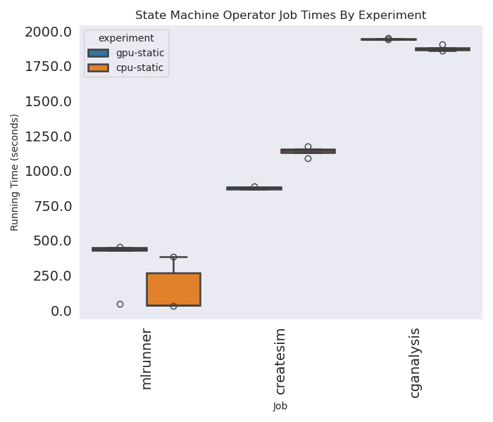
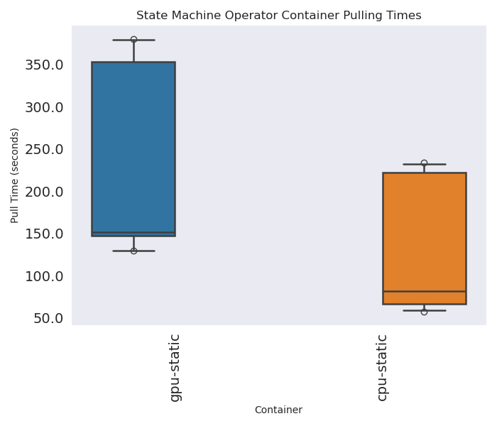
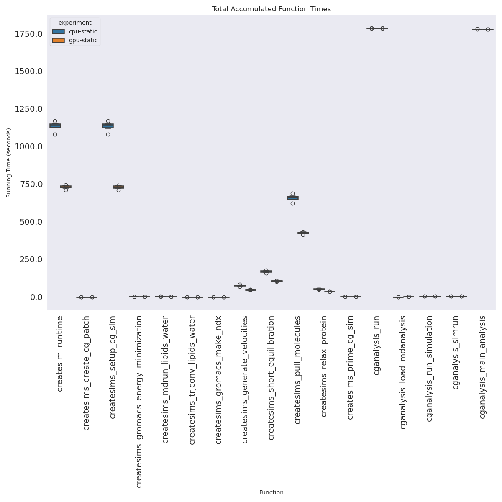

# State Machine Operator Experiment

> This paradigm is part of the Mummi experiments. Here we are testing using the State Machine Operator, which uses a state machine and removes some of the persistent services in favor of Kubernetes events

```bash
git clone https://github.com/converged-computing/mummi-experiments
cd ./mummi-experiments/experiments/aws-march-2025/state-machine-operator
```

Final results:

 - gpu-static-1
 - cpu-static-1

## Experiments

There will be four experiments - one for GPU and one for CPU, and each with and without autoscaling.

> TODO for GPU autoscaling add --node-labels k8s.amazonaws.com/accelerator=<gpu-type> so we need a second file. Also need to think about general design.

```bash
# GPU
eksctl create cluster --config-file ../eks-config-gpu-static.yaml
eksctl create cluster --config-file ../eks-config-gpu-autoscaling.yaml
aws eks update-kubeconfig --region us-east-1 --name mini-mummi-gpu

# CPU
eksctl create cluster --config-file ../eks-config-cpu-static.yaml 
eksctl create cluster --asg-access --config-file ../eks-config-cpu-autoscaling.yaml
aws eks update-kubeconfig --region us-east-2 --name mini-mummi
```

```bash
kubectl create namespace monitoring
kubectl apply -f ../../../event-monitor

# In a different terminal, this will save nodes and collect events.
environ=cpu-static-1
region=us-east-2
instance=hpc6a.48xlarge

# environ=gpu-static-1
# region=us-east-1
# instance=p3.2xlarge

mkdir -p ./monitor/${environ}
kubectl get nodes -o json > ./monitor/${environ}/nodes-$(date +%s).json

# Topology API (only for hpc instance types)
# Note that I was running an a la carte gpu instance in this region, needs to be filtered out
aws ec2 describe-instance-topology --region ${region} --filters Name=instance-type,Values=${instance} > ./monitor/${environ}/topology.json
aws ec2 describe-instances --filters "Name=instance-type,Values=${instance}" --region ${region}  > ./monitor/${environ}/instances.json

kubectl logs -n monitoring $(kubectl get pods -n monitoring -o json | jq -r .items[0].metadata.name) -f |& tee ./monitor/${environ}/events-$(date +%s).json
```

#### State Machine Operator

Install the operator. Note this requires pushing to a development registry, and you'd need to customize if you don't have access (you likely won't, but I doubt anyone will try to reproduce this).

```bash
# commit for cpu and gpu
# f0e880c46277e49c5b301f92bee93e58e127addc
git clone https://github.com/converged-computing/state-machine-operator
cd state-machine-operator
make test-deploy-recreate
```

Run the Experiment. Note that since the resources here are going directly to Kubernetes, we ask for exactly what we want each job to have.

```bash
kubectl apply -f ./crd/gpu-mummi.yaml
kubectl apply -f ./crd/cpu-mummi.yaml
```

## Saving data files

When the workflow is complete, we can save the state, etc. First, get output for the different components. For each of the manager and registry, do:

```bash
# In a different terminal, this will save nodes and collect events.
# environ=gpu-static-1
environ=cpu-static-1

#kubectl logs <container>  > ./monitor/${environ}/<container>.out
kubectl get pods -o wide > ./monitor/${environ}/final-pods-state.txt
kubectl get pods -o json > ./monitor/${environ}/final-pods-state.json

# Copy times from the manager
kubectl cp mummi-manager-86ddd95986-5gctw:/workflow-times.json workflow-times.json
```

I found the easiest thing to do was expose the headless service, and then oras pull to my local machine.

```bash
# In another terminal
kubectl port-forward registry-0 5000:5000
oras repo ls localhost:5000

mkdir -p ./monitor/$environ/data
cd ./monitor/$environ/data
oras repo ls localhost:5000 > repos.txt
# Download artifacts organized by structure (repo) and step (tag)
registry=localhost:5000
root=$(pwd)
for repo in $(oras repo list --plain-http $registry) 
  do 
    for tag in $(oras repo tags --plain-http $registry/$repo)
      do 
        mkdir -p $root/$repo/$tag
        cd $root/$repo/$tag
        oras pull --plain-http $registry/$repo:$tag
    done
done
cd $root
```

## Cleanup

```bash
# GPU
kubectl delete -f crd/gpu-mummi.yaml
eksctl delete cluster --config-file ../eks-config-gpu-static.yaml --wait

# CPU
kubectl delete -f crd/cpu-mummi.yaml
eksctl delete cluster --config-file ../eks-config-cpu-static.yaml --wait
```

## Notes

- The GPU mlrunner had an error, but it simply created another state machine to replace it.
- The state machine operator uses GROMACS instead of GROMACS_PARTS to support feedback better, they are functionally equivalent
- It's hard to say (this is subjective) but it seems like there are more errors when gromacs is running on CPU.


## Quick Analysis

Some quick glances at output - this is hugely incomplete because we aren't comparing to anything interesting, but it's a start to parsing results.

### Job Times

This shows total job times for each job type between environments. The createsim cpu static was hurt because one of the jobs ran for the entire lifecycle of the workflow, occupying an entire node, and never finished. This means we ran with 1 instead of 2 nodes for that entire job family, which I imagine at least 1.5x the time.  These are mean job times:

```console
job         experiment
cganalysis  cpu-static    11251
            gpu-static     9716
createsim   cpu-static     6840
            gpu-static     5266
mlrunner    cpu-static     2352
            gpu-static     2259
```

Note that we have an extra job here (as compared to mummi-operator) because the mummi-operator runs the mlserver and doesn't represent that work as a job.



Here are times in a format easier to parse - these are the total summed times across jobs (so much longer than total experiment).

```console
```

### Pull Times

These are total summed pulling times, just for containers relevant to mummi (the others are small and trivial anyway). Obviously GPU containers are bigger and take longer.

```console
experiment
cpu-static     2273.73425
gpu-static    4037.924493
```



### Job Counts Completed

These are job completions, as assessed by the output that we have. Note that this does not include jobs that were running and didn't complete.

```console
Name: duration, dtype: object
Experiment Job Counts (completed with results)
   experiment         job count
0  cpu-static    mlsample     6
1  cpu-static   createsim     6
2  cpu-static  cganalysis     6
3  gpu-static    mlsample     6
4  gpu-static   createsim     6
5  gpu-static  cganalysis     6
```

Given we needed just 6, here are excess.

```console
Excess Completed
   experiment         job count
0  cpu-static    mlsample     0
1  cpu-static   createsim     0
2  cpu-static  cganalysis     0
3  gpu-static    mlsample     0
4  gpu-static   createsim     0
5  gpu-static  cganalysis     0
```

The mlsample generates quickly enough that we will not have any partial results (generated but not done).

### Partial Job Excess

These are running that started but didn't complete. You can look at the final-pod-state.txt in each output directory to see where this comes from. These are in _addition_ to the excess above in terms of time. We could likely calculate the extra cost of these extra completed runs and incompleted partial runs.

- GPU:
  - createsim: 0
  - cganalysis: 0
- CPU:
  - createsim: 0
  - cganalysis: 0


### Workflow Manager Times

We can look at summed times for the workflow manager, and really there are only a few that add up to anything significant.

```console
experiment  global                                  job       
cpu-static  cganalysis_load_mdanalysis              cganalysis        2.860723
            cganalysis_main_analysis                cganalysis    10670.142889
            cganalysis_run                          cganalysis    10703.388473
            cganalysis_run_simulation               cganalysis       30.067266
            cganalysis_simrun                       cganalysis       30.066717
            createsim_runtime                       createsim      6810.279626
            createsims_create_cg_patch              createsim         0.004759
            createsims_generate_velocities          createsim       457.046979
            createsims_gromacs_energy_minimization  createsim         4.439008
            createsims_gromacs_make_ndx             createsim         2.244049
            createsims_mdrun_lipids_water           createsim        21.177514
            createsims_prime_cg_sim                 createsim         5.593954
            createsims_pull_molecules               createsim      3950.427453
            createsims_relax_protein                createsim       311.149365
            createsims_setup_cg_sim                 createsim      6804.613958
            createsims_short_equilibration          createsim      2045.227524
            createsims_trjconv_lipids_water         createsim         0.992852
gpu-static  cganalysis_load_mdanalysis              cganalysis        4.613697
            cganalysis_main_analysis                cganalysis    10672.765678
            cganalysis_run                          cganalysis    10707.948853
            cganalysis_run_simulation               cganalysis       30.069072
            cganalysis_simrun                       cganalysis       30.068255
            createsim_runtime                       createsim      4380.513536
            createsims_create_cg_patch              createsim         0.007732
            createsims_generate_velocities          createsim        282.24518
            createsims_gromacs_energy_minimization  createsim         7.148199
            createsims_gromacs_make_ndx             createsim         3.083366
            createsims_mdrun_lipids_water           createsim        16.859448
            createsims_prime_cg_sim                 createsim         9.528762
            createsims_pull_molecules               createsim      2548.790544
            createsims_relax_protein                createsim       212.081036
            createsims_setup_cg_sim                 createsim       4370.86876
            createsims_short_equilibration          createsim      1281.445826
            createsims_trjconv_lipids_water         createsim         1.681575
Name: duration, dtype: object
```

Here we see the most relevant is the workflow running time to get 6 samples - we will want to compare this across environments.

```console
experiment  global            
cpu-static  cganalysis_success    11249.149054
            createsim_success      6840.516244
            mlrunner_failure         73.234189
            mlrunner_success         228.65294
            workflow_complete      3101.351853
gpu-static  cganalysis_success    11681.761824
            createsim_success      5266.454788
            mlrunner_failure        450.427124
            mlrunner_success       2260.015055
            workflow_complete      3327.152879
```

### Function Times



I haven't done autoscaling yet - going to do the single node experiments first.
