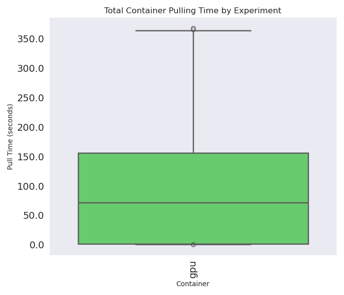
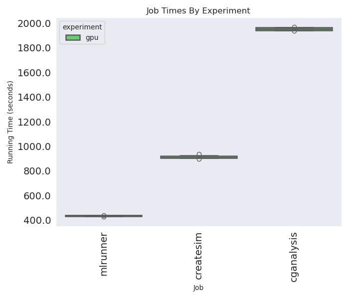
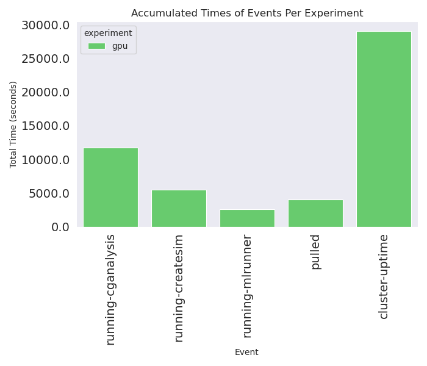

# State Machine Experiments

This will extend the [first test](../test-january-2025) of traditional Mummi to run the same setups with a state machine model. To this test we are adding the feedback saving, done for each frame. The same applies:

1. Either CPU (hpc6a.48xlarge, $2.88/hour on demand) or GPU nodes (p3.2xlarge, $3.06/hour on demand).
2. Event exporting with [kubernetes-event-exporter](https://github.com/resmoio/kubernetes-event-exporter)
3. 6 Nodes total.
4. A total of 6 total runs (cganalysis).
5. We will time from when nodes come up to when the last run finishes.

For CPU nodes, we will ask for 94/96 cores per task. For GPU, since the GPU has 1/node, that specification on the request will handle the scheduling topology. For setup for both:

```bash
# 3de98b266c023c393997bd5fba5f441f336f8b0f
git clone https://github.com/converged-computing/state-machine-operator
cd state-machine-operator
```

And you will need the repository root here to create the clusters, etc.

```bash
git clone https://github.com/converged-computing/mummi-experiments
cd ./mummi-experiments/test-february-12-2025
```

## Experiments

The sections below show how to do a run of either a CPU or GPU experiment. The run number will create a hierarchy under either [data](data) or [monitor](monitor).

## 1. Create Cluster

```bash
# GPU cluster
eksctl create cluster --config-file ./eks-config-gpu-6.yaml
aws eks update-kubeconfig --region us-east-1 --name mini-mummi-gpu
```

<details>

<summary>EKS Cluster Creation</summary>

First GPU cluster (1)

```console
```


</details>

Install the monitoring tool.

```bash
kubectl create namespace monitoring
kubectl apply -f ../event-monitor

# In a different terminal, this will save nodes and collect events.
run_number=1
environ=gpu
# environ=cpu
mkdir -p ./monitor/${environ}/${run_number}
kubectl get nodes -o json > ./monitor/${environ}/${run_number}/nodes-$(date +%s).json
kubectl logs -n monitoring $(kubectl get pods -n monitoring -o json | jq -r .items[0].metadata.name) -f |& tee ./monitor/${environ}/${run_number}/events-$(date +%s).json
```

## 2. Install the Operator

```bash
make test-deploy-recreate
```

## 3. Run the Experiment

```bash
kubectl apply -f gpu-mummi.yaml
kubectl apply -f cpu-mummi.yaml
```

Note that I chose to run the workflow manager interactively, meaning I shelled in and manually started it. 

```bash
kubectl exec -it mummi-sample-wfmanager-64d87ddb87-44mkd -- bash
cp /state_machine_operator/entrypoint.sh
# remove sleep infinity then run
/bin/bash kubernetes_start.sh
```

I did this in case I wanted to stop it and tweak any of the configuration files. From that point you'll need to monitor the jobs and stop (saving data first) when the final cganalysis is done. The events tool will collect container pulling times. When we improve upon the setup, we will have this stopping point more clearly defined.

## 4. Save data files

Here is how you can interactively count the cganalysis result runs. You'll need to install oras in a container like the wfmanager (or use the mlserver, although we shouldn't interrupt it running):

```bash
# Install oras
VERSION="1.2.2"
curl -LO "https://github.com/oras-project/oras/releases/download/v${VERSION}/oras_${VERSION}_linux_amd64.tar.gz"
mkdir -p oras-install/
tar -zxf oras_${VERSION}_*.tar.gz -C oras-install/
mv oras-install/oras /usr/local/bin/
rm -rf oras_${VERSION}_*.tar.gz oras-install/

# Count
for repo in $(oras repo list --plain-http registry-0.mummi-sample.default.svc.cluster.local:5000); do count=$(oras repo tags --plain-http registry-0.mummi-sample.default.svc.cluster.local:5000/$repo | grep cganalysis | wc -l); if [[ "${count}" != "0" ]]; then echo $count; fi; done
```

I found the easiest thing to do was expose the headless service, and then oras pull to my local machine.

```bash
run_number=1
envion=gpu
#environ=cpu
mkdir -p ./data/${environ}/${run_number}/
cd ./data/${environ}/${run_number}

# In another terminal
kubectl port-forward registry-0 5000:5000
oras repo ls localhost:5000

# Download artifacts organized by structure (repo) and step (tag)
registry=localhost:5000
# registry=registry-0.mummi-sample.default.svc.cluster.local:5000
root=$(pwd)
for repo in $(oras repo list --plain-http $registry) 
  do 
    for tag in $(oras repo tags --plain-http $registry/$repo)
      do 
        mkdir -p $root/$repo/$tag
        cd $root/$repo/$tag
        oras pull --plain-http $registry/$repo:$tag
    done
done
```

## 5. Cleanup

This will stop the event exporter from running, etc.

```bash
# Delete the GPU cluster
eksctl delete cluster --config-file ./eks-config-gpu-6.yaml --wait
kubectl delete pods --all --all-namespaces

# Delete the CPU cluster
eksctl delete cluster --config-file ./eks-config-hpc6a.yaml --wait
kubectl delete pods --all --all-namespaces
```

<details>

<summary>Cluster Deletion</summary>

First GPU run

```console
2025-02-01 23:31:46 [ℹ]  deleting EKS cluster "mini-mummi-gpu"
2025-02-01 23:31:47 [ℹ]  will drain 0 unmanaged nodegroup(s) in cluster "mini-mummi-gpu"
2025-02-01 23:31:47 [ℹ]  starting parallel draining, max in-flight of 1
2025-02-01 23:31:47 [✖]  failed to acquire semaphore while waiting for all routines to finish: context canceled
2025-02-01 23:31:47 [ℹ]  deleted 0 Fargate profile(s)
2025-02-01 23:31:48 [✔]  kubeconfig has been updated
2025-02-01 23:31:48 [ℹ]  cleaning up AWS load balancers created by Kubernetes objects of Kind Service or Ingress
2025-02-01 23:31:50 [ℹ]  
2 sequential tasks: { delete nodegroup "workers", delete cluster control plane "mini-mummi-gpu" 
}
2025-02-01 23:31:50 [ℹ]  will delete stack "eksctl-mini-mummi-gpu-nodegroup-workers"
2025-02-01 23:31:50 [ℹ]  waiting for stack "eksctl-mini-mummi-gpu-nodegroup-workers" to get deleted
2025-02-01 23:31:50 [ℹ]  waiting for CloudFormation stack "eksctl-mini-mummi-gpu-nodegroup-workers"
2025-02-01 23:32:20 [ℹ]  waiting for CloudFormation stack "eksctl-mini-mummi-gpu-nodegroup-workers"
2025-02-01 23:33:16 [ℹ]  waiting for CloudFormation stack "eksctl-mini-mummi-gpu-nodegroup-workers"
2025-02-01 23:34:25 [ℹ]  waiting for CloudFormation stack "eksctl-mini-mummi-gpu-nodegroup-workers"
2025-02-01 23:35:06 [ℹ]  waiting for CloudFormation stack "eksctl-mini-mummi-gpu-nodegroup-workers"
2025-02-01 23:36:34 [ℹ]  waiting for CloudFormation stack "eksctl-mini-mummi-gpu-nodegroup-workers"
2025-02-01 23:37:55 [ℹ]  waiting for CloudFormation stack "eksctl-mini-mummi-gpu-nodegroup-workers"
2025-02-01 23:39:52 [ℹ]  waiting for CloudFormation stack "eksctl-mini-mummi-gpu-nodegroup-workers"
2025-02-01 23:41:22 [ℹ]  waiting for CloudFormation stack "eksctl-mini-mummi-gpu-nodegroup-workers"
2025-02-01 23:42:35 [ℹ]  waiting for CloudFormation stack "eksctl-mini-mummi-gpu-nodegroup-workers"
2025-02-01 23:43:33 [ℹ]  waiting for CloudFormation stack "eksctl-mini-mummi-gpu-nodegroup-workers"
2025-02-01 23:44:48 [ℹ]  waiting for CloudFormation stack "eksctl-mini-mummi-gpu-nodegroup-workers"
2025-02-01 23:44:48 [ℹ]  will delete stack "eksctl-mini-mummi-gpu-cluster"
2025-02-01 23:44:48 [ℹ]  waiting for stack "eksctl-mini-mummi-gpu-cluster" to get deleted
2025-02-01 23:44:48 [ℹ]  waiting for CloudFormation stack "eksctl-mini-mummi-gpu-cluster"
2025-02-01 23:45:18 [ℹ]  waiting for CloudFormation stack "eksctl-mini-mummi-gpu-cluster"
2025-02-01 23:45:59 [ℹ]  waiting for CloudFormation stack "eksctl-mini-mummi-gpu-cluster"
2025-02-01 23:47:03 [ℹ]  waiting for CloudFormation stack "eksctl-mini-mummi-gpu-cluster"
2025-02-01 23:47:04 [✔]  all cluster resources were deleted
```

Second GPU run:

```console
```

</details>


## Results

Notes:

- I am using the eksctl reported time for when the workers groups are created / deleted to derive the total cost of the cluster, which is easiest since we don't have elasticity
- We can't get reliable information about jobs finishing from the pods, we need to get them from the jobs.
- Jobs that never complete (succeed or fail) are ones that are still running when the cluster is deleted. There could be other ways to consider these, but for now I am considering them sunk cost because we don't have final result data.
- All runs produced the same data output, as in 6x cganalysis full results (and some number of createsims / initial MLserver output)
- We need to check that the complete cganalysis result is there (I think I just have logs)

### Labels

- gpu-manual (purple): is the first run, where there was a bug in counting. This only meant that jobs weren't launched when they should have been. This means the overall cluster cost will be higher (due to delay in running and be debugging) but the jobs we measure (the images here) are not impacted.
- gpu (green): is the second, fully automated run (with the bug above fixed).
- cpu-manual: is the only run of hpc6a, and it required a manual restart of the mlserver and wfmanager that froze due to rabbitmq. This will not be reflected in individual run times, but will the overall cluster up time (and cost).

### Pull times



- This includes all containers for the cluster, and the majority are our analysis containers.
- We would expect CPU pulls to be faster than GPU, because containers are smaller. This is exactly what we see.

### Job times 



#### (cganalysis)

- I noticed this in running - the actual end time of cganalysis can go up to 35 minutes. I assume there is some kind of iteration running, and it just stops after it sees it has gone beyond the time limit (but is free to do that within the context of the iteration)
- We can (maybe) use that to estimate time it would take to run a longer timespan (we talked about this in the meeting)
- Because we stop it, we can't say anything about differences in running CGanalysis on CPU vs GPU (but logically it needs GPU)

#### (createsim)
- I assume the variability in times for the GPU environments is more about variability in createsims than anything about the environments.
- Eyeballing it, I'd say a createsims cpu run is approximately 3-6 minutes longer on CPU than GPU.

### Total times



I like this plot because it shows what is often not shown - the cost of not having good automation. The gpu-manual run that needed debugging was up just over an hour longer than the other gpu run, because I needed to debug, but primarily because when I was debugging we weren't doing analyses. The accumulated time of that (1 hour) that was added to still get 6 cganalysis results led to the increase in cost (~18) (shown below). I think this is interesting because most papers would report the analysis run times and not the cluster times.

### Costs

```bash
{'gpu-manual': 58.925399999999996, 'gpu': 39.3006, 'cpu-manual': 40.9488}
```

Our estimate for gpu was spot on - we estimated $40.54, and (when nothing goes wrong, the second value) we got really close to that. However, we did overestimate that time (20 minutes) when it took between 14-18, so that extra wiggle time includes container pulling and cluster prep. The first run (gpu-manual) being above that reflects the extra time for runs and my debugging time. For CPU, we were below our estimate ($46.80), despite the issue, and that is because we overestimated the time to run, putting 30 minutes when it took closer to 20.

### Results Produced

This shows easily how inefficient the workflow orchestration is. Even when we reduce the mlserver output (and make it run more iterations) we still generate > 200 simulation starting points. We of course use less than 10.

```bash
{'createsim': {'cpu-manual': 8, 'gpu-manual': 10, 'gpu': 8}, 'cganalysis': {'cpu-manual': 6, 'gpu-manual': 7, 'gpu': 6}, 'mlserver': {'cpu-manual': 243, 'gpu-manual': 204, 'gpu': 216}}
```
